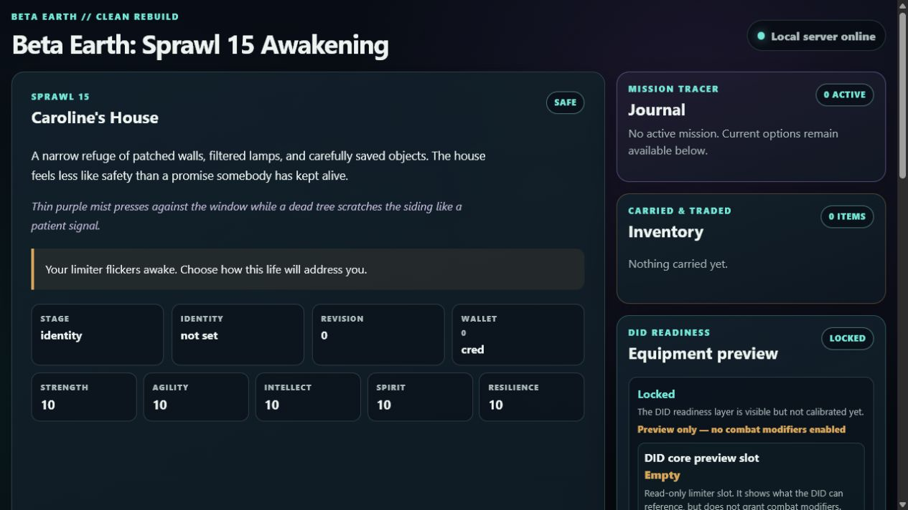

# Beta Earth

[](https://github.com/Jnapier2/beta-earth/actions/workflows/ci.yml)

Beta Earth is a local-first, browser-based role-playing game vertical slice built with Python's standard library. It demonstrates a cleanly layered game engine, validated content catalogs, revision-safe persistence, and a loopback-only HTTP interface without third-party runtime dependencies.



Version `0.4.11` includes a six-room Sprawl 15 scenario, character setup, Caroline's guided route mission, wallet and inventory state, one accountable barter transaction, and a read-only DID readiness preview.

## Engineering highlights

- **Layered design:** domain rules and models stay independent of application, infrastructure, and presentation adapters.
- **One command surface:** the HUD, API authorization, keyboard shortcuts, mission tracer, and barter actions share the same ordered set of current actions.
- **Defensive persistence:** JSON saves use strict validation, atomic replacement, revision checks, bounded migrations, and migration backups.
- **Local security boundary:** the bundled server binds only to `127.0.0.1`, rejects non-loopback host/origin inputs, limits request size and concurrency, and serves restrictive security headers.
- **Portable runtime:** content and runtime paths are project-relative; an OS-assigned port avoids scanning or displacing other applications.
- **Accessible UI:** the HUD includes keyboard navigation, visible focus, reduced-motion support, forced-color support, responsive layouts, and minimum target sizing.

## Run locally

Requirements: Python 3.11, 3.12, or 3.13. No package installation is required.

On Windows, run:

```powershell
.\START_BETA_EARTH.bat
```

On any supported Python environment, run:

```bash
python run_beta_earth.py
```

The program opens a browser to an OS-assigned loopback address. Press `Ctrl+C` in the terminal to stop it. To validate startup without opening a browser or keeping the server running:

```bash
python run_beta_earth.py --dry-run --no-browser
```

Runtime state is written only to ignored project-local folders such as `state/`, `logs/`, and `temp/`.

## Test

```bash
python -m unittest discover -s tests -t . -v
```

The suite covers domain validation, application transactions, migrations and persistence, loopback HTTP behavior, mission and economy flows, UI contracts, and startup resilience.

## Project map

| Path | Purpose |
|---|---|
| `src/beta_earth/domain/` | Typed models and pure game rules |
| `src/beta_earth/application/` | Use cases, command authorization, and ports |
| `src/beta_earth/infrastructure/` | Catalog loading, persistence, runtime paths, and instance ownership |
| `src/beta_earth/presentation/` | HTTP adapter and view-model projection |
| `data/` | Validated world, quest, and economy catalogs with JSON schemas |
| `static/` | Local browser HUD |
| `tests/` | Unit and integration tests |

Additional design context is available in [Architecture](docs/ARCHITECTURE.md), [Engineering decisions](docs/DECISIONS.md), and [Compatibility](docs/COMPATIBILITY.md).

## Scope and status

This is a working single-player vertical slice, not a hosted service or a complete game. Multiplayer, internet hosting, combat, dynamic markets, and mutable equipment are outside the current scope. Save schema `4.0` remains the current format.

Created by J. R. Napier. Copyright is held by Gateway Information Group LLC. See [LICENSE.md](LICENSE.md) for terms.
