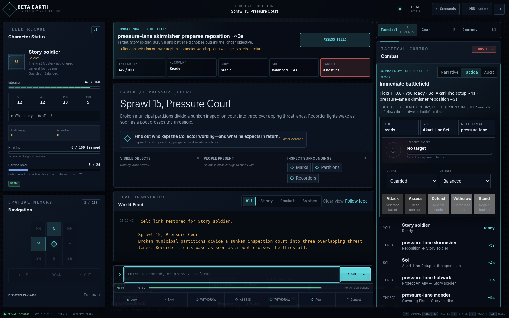

# Beta Earth: Sovereignty Next

[](https://github.com/Jnapier2/beta-earth/actions/workflows/ci.yml)

[Portfolio](https://jerry-napier-portfolio.netlify.app/) · [GitHub profile](https://github.com/Jnapier2)

Beta Earth is a local-first browser RPG that turns a large narrative world into a testable command-driven system. Version `0.51.1` combines a shared battlefield clock, independently scheduled combatants, faction pledges, civic choices, revision-safe saves, and an information-dense HUD without requiring a framework or cloud service.



## What stands out

- **Battlefield truth:** the Tactical view presents every active actor, intent, target, readiness window, interruption, and tactical effect from the engine's authoritative state.
- **Consequential choices:** seven faction pledge routes and the Sprawl 15 civic chain use explicit confirmation, bounded rewards, and durable receipts without implying authority the player has not earned.
- **A substantial playable world:** the validated catalog contains 118 connected rooms, 35 items, 32 creature profiles, 15 classes, and layered progression through level 20.
- **Reliable local state:** SQLite persistence, schema migrations, revision checks, backups, and project-local runtime folders make saves recoverable and portable.
- **Accessible by design:** keyboard navigation, visible focus, reduced-motion and high-contrast support, reading modes, responsive drawers, and persistent primary combat actions are built into the HUD.
- **Lean runtime:** Python's standard library powers the engine, persistence, and loopback server. No package installation or external account is required.

## Run locally

Requirements: Windows 10 or 11, Python 3.11–3.13, and a current desktop browser. See [System requirements](SYSTEM_REQUIREMENTS.md) for the full support boundary.

```powershell
.\BetaEarthSovereignty.bat
```

For a read-only content and startup check:

```powershell
.\BetaEarthSovereignty.bat --dry-run
```

For the end-to-end local HUD, save, and diagnostic check:

```powershell
.\BetaEarthSovereignty.bat --self-test
```

On another supported Python environment:

```bash
python BetaEarthSovereignty.py
```

Runtime state remains in ignored project-local folders. The server selects an available loopback port and never binds to an external interface.

## Engineering approach

| Area | Implementation |
|---|---|
| Domain | Combat, progression, sovereignty, recovery, and state migrations |
| Application | Command parsing, scheduling, services, and deterministic results |
| Infrastructure | Validated content loading, SQLite persistence, diagnostics, and startup checks |
| Presentation | Command-line client plus a token-protected loopback browser HUD |
| Verification | Representative engine, combat, persistence, content, HUD, and launch tests in CI |

The HUD consumes engine projections rather than inferring game rules in JavaScript. Informational commands are explicitly reading-safe; consequential actions advance the shared clock and produce state receipts. This keeps presentation detail separate from outcome authority.

More detail is available in [Architecture](docs/ARCHITECTURE.md) and [Public release notes](CHANGELOG.md).

## Public evaluation boundary

This repository contains a source-visible evaluation build, not a hosted service or an open-source license. Private canon sources, design documents, editable development fixtures, release tooling, and internal planning records are not included.

The public build uses an original deterministic ambient track generated from the included script. The user-supplied track present in the private build is intentionally excluded because public redistribution rights have not been independently confirmed.

Created by Jerry R. Napier. Copyright © 2026 Gateway Information Group LLC. All rights reserved. See [LICENSE.md](LICENSE.md).
